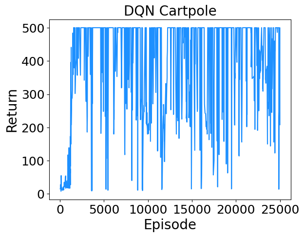
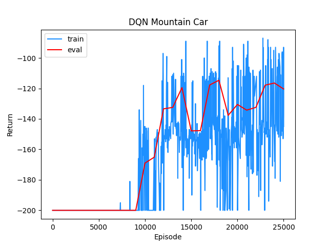

# Deep Q Learning (DQN)
This repository contains a clean and minimal implementation of Deep Q Learning (DQN) algorithm in Pytorch.

## Tested on
* [Cart Pole](https://www.gymlibrary.dev/environments/classic_control/cart_pole/) (OpenAI Gym) - Move back and forth to balance a pole on a cart.

* [Mountain Car ](https://www.gymlibrary.dev/environments/classic_control/mountain_car/) (OpenAI Gym) - Move back and forth to build up enough momentum to drive up a big hill.

## References
* "Playing Atari with Deep Reinforcement Learning", Mnih et al. [Link](https://www.cs.toronto.edu/~vmnih/docs/dqn.pdf).
* "Human-level control through deep reinforcement learning", Mnih et al. [Link](https://web.stanford.edu/class/psych209/Readings/MnihEtAlHassibis15NatureControlDeepRL.pdf).
